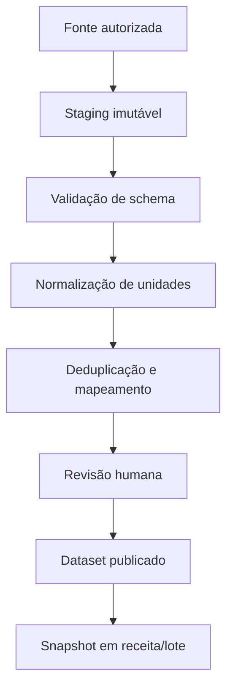

# Dados de referência e catálogos

## Princípio

A BrassIA possui um catálogo interno. Fontes externas alimentam uma área de staging; somente registros validados e aprovados são publicados. Receitas publicadas e ordens de produção referenciam snapshots, nunca um registro externo mutável.

## Tipos de fonte

- padrão oficial: BJCP e Brewers Association;
- padrão de intercâmbio: BeerJSON e BeerXML;
- fabricante: fichas técnicas, COA, CSV, XLSX ou JSON autorizado;
- integração de conta: Brewfather e Brewer's Friend;
- contribuição manual: cadastrada por usuário e marcada como não verificada;
- curadoria BrassIA: dado revisado internamente com referências.

## Metadados obrigatórios

Todo registro importado deve guardar:

- `source_system`;
- `source_record_id`, quando existir;
- `source_url`;
- `dataset_version`;
- `published_at` e `retrieved_at`;
- `license_name` e `permission_status`;
- `content_checksum`;
- `review_status`, revisor e data;
- `effective_from` e `effective_to`;
- payload original imutável;
- mapeamento para o modelo canônico;
- divergências, avisos e campos não reconhecidos.

## Estilos cervejeiros

O modelo deve suportar múltiplos conjuntos simultâneos:

- BJCP Beer 2021, incluindo errata e estilos provisórios separados;
- BJCP Mead 2015;
- BJCP Cider 2025;
- Brewers Association 2026;
- perfil interno ou de competição;
- estilo livre sem enquadramento obrigatório.

Campos mínimos:

- autoridade, família, edição e idioma;
- categoria, código, nome e aliases;
- OG, FG, ABV, IBU, SRM/EBC e carbonatação em faixas;
- impressão geral e descritores sensoriais autorizados;
- instruções especiais de inscrição quando licenciadas;
- indicação de texto completo disponível ou somente metadados permitidos;
- copyright, atribuição e link da fonte.

O comparador exibe conformidade numérica como ajuda. Fora da faixa significa alerta, não invalidação automática.

## Maltes e fermentáveis

Campos recomendados:

- fabricante, produto, origem, tipo e grupo;
- cor mínima/máxima;
- potencial ou extrato fine/coarse grind;
- umidade, proteína, FAN, poder diastático e Kolbach;
- friabilidade, beta-glucano, pH DI, fermentabilidade e diferença fine/coarse;
- percentual máximo recomendado;
- necessidade de mostura;
- alergênicos, safra/lote e validade;
- descritores sensoriais, substitutos e estilos sugeridos.

## Lúpulos

Campos recomendados:

- variedade, breeder, marca registrada, origem e ano de lançamento;
- alfa, beta, cohumulone e total de óleos em faixas;
- myrcene, humulene, caryophyllene, farnesene e outros óleos quando informados;
- forma, safra, HSI/condição e armazenamento;
- aroma, sabor, intensidade, finalidade e substitutos;
- uso típico em fervura, whirlpool e dry hop;
- fonte da ficha e data de revisão.

Valores variáveis por safra pertencem ao lote de estoque. O catálogo guarda faixas de referência.

## Leveduras e culturas

Campos recomendados:

- laboratório, código do produto, tipo e forma;
- faixa de temperatura e atenuação;
- floculação, tolerância alcoólica e pressão;
- POF, STA1/glucoamylase, killer factor e comportamento de sedimentação;
- necessidade de oxigênio/nutrientes quando publicada;
- estilos sugeridos, notas sensoriais e equivalências;
- validade, células ou massa e método de pitch;
- limite recomendado de reutilização.

Equivalência não significa identidade. A tela deve mostrar diferenças de atenuação, temperatura, floculação e perfil sensorial.

## Água cervejeira

Separar claramente:

1. **Fonte de água:** torneira, poço, mineral, osmose reversa ou desmineralizada apta.
2. **Laudo:** composição medida em uma data, laboratório, método e incerteza.
3. **Perfil alvo:** objetivo de íons para uma receita.
4. **Mistura:** volumes de cada fonte.
5. **Tratamento:** sais, ácidos, bases, diluição, fervura ou remoção de cloro.

Campos:

- Ca, Mg, Na, Cl, SO4, HCO3 e, quando disponível, CO3, K, Fe, NO3, NO2 e F;
- pH, alcalinidade, dureza e temperatura;
- relação sulfato/cloreto apenas como indicador;
- balanço de cargas com tolerância explícita;
- data, origem, confiança e observações.

Perfis históricos de cidades são educativos; não devem ser tratados como receita mineral exata para cervejas modernas.

## Outros catálogos

- sais, ácidos e bases;
- nutrientes, enzimas, clarificantes e finings;
- frutas, especiarias, café, cacau, madeira e outros adjuntos;
- limpadores e sanitizantes com FISPQ/SDS e compatibilidade;
- embalagens, tampas, latas, barris, kegs e acessórios;
- CO2, N2 e misturas de gases;
- instrumentos, soluções de calibração e materiais de laboratório.

## Workflow de importação

## Deduplicação

Uma chave natural pode combinar tipo, fabricante normalizado e código do produto. Nome semelhante nunca é suficiente para mesclar automaticamente. Conflitos ficam em fila de revisão.

## Atualização

- nova fonte gera novo dataset, não edição silenciosa;
- item removido fica descontinuado;
- receitas existentes continuam apontando para o snapshot anterior;
- comparação de datasets mostra inclusão, alteração e remoção;
- rollback publica uma nova decisão, sem apagar auditoria.

